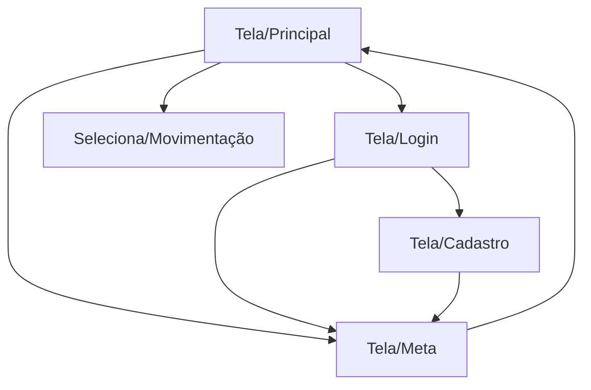
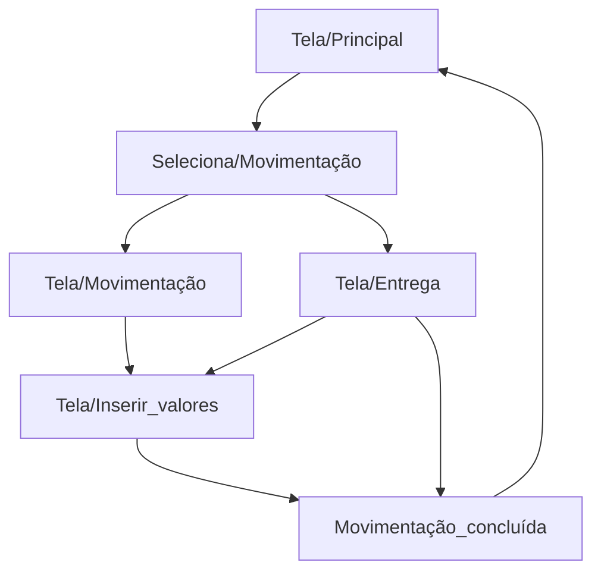
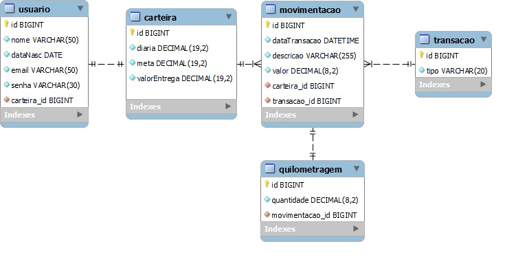

# Carteira do Zé   
**Carteira do Zé** *Sua carteira mais inteligente*
# Sobre o projeto

[https://carteiradoze.com.br](https://github.com/CarteiraDoZe/backEnd_carteiraDoZe "Carteira do Zé")

**_Carteira do Zé_** é uma aplicação web de gerenciamento financeiro para entregadores. O seu desenvolvimento ocorreu durante o bootcamp **JAVA FullStack** oferecido por [Generation](https://brazil.generation.org "Site da Generation") e [Zé Delivery](https://www.ze.delivery "Site do Zé Delivery").

A **_Carteira do Zé_** tem como objetivo potencializar o crescimento financeiro de profissionais entregadores, facilitando a gestão de receitas e despesas orientadas à meta de ganho mensal com base na metodologia SMART.

## Fluxo do usuário
####Primeiro acesso

####Registro de movimentações

## DER - Diagrama Entidade Relacionamento

# Tecnologias utilizadas
## Back end &nbsp; 

- Java
- Spring Boot
- JPA / Hibernate
- Maven

## Implantação em produção
- MySQL / PostgreSQL (Deploy)

# Padrão semântico de commits
  - ***Fix:*** Usado quando o commit for feito para corrigir um problema no código
  - ***Feat:*** Usado quando tem um novo recurso no código
  - ***New:*** Novos arquivos
  - ***Build:*** Quando foi executado o build da nossa aplicação
  - ***Chore:*** Quando foi adicionada uma nova dependência ou configuração
  - ***Refactor:*** Quando for executada uma refatoração no código
  - ***Docs:*** Usado quando ouver uma mudança na documentação do projeto
  - ***Test:*** Quando foir executado um teste na aplicação

# Colaboradores

| [ Wagner Moreira ](https://github.com/wagnermor) | [ Christian Patrick ](https://github.com/ChrisPCruz99) | [ William Matheus ](https://github.com/OWillMatheuz) | 
|:---:|:---:|:---:|
